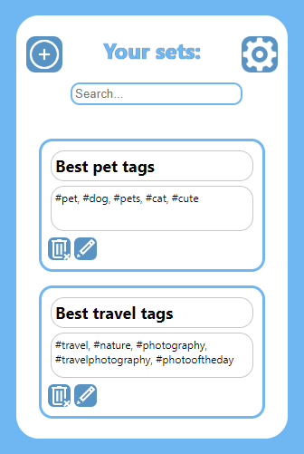

# HashtagManager
HashtagManager is a browser extension for organizing hashtags to ease proffesional social media management on platforms like Instagram or Facebook.  

This project was started on a template from the great [extensionizr.com](https://extensionizr.com).  
It has translations for both Polish and English.  
Tested on both Chrome and Firefox, and should run with no problems on browsers using the same engines.
Safari and MacOS support is strongly desired but progress has been stalled as I do not posses an Apple device. Any help with this would be greatly appreciated.

## Usage:
* This extension can be used by [loading an unpacked extension](https://developer.chrome.com/docs/extensions/mv3/getstarted/development-basics/#load-unpacked) in chrome,
* or by [loading a temporary extension](https://developer.mozilla.org/en-US/docs/Mozilla/Add-ons/WebExtensions/Your_first_WebExtension#trying_it_out), in firefox.
* In the future it should be possible to install it from the respective extension store.
You might need [firefox for developers](https://www.mozilla.org/en-US/firefox/developer/) to load an unpublished extension, such as this one. 

## Contributions:
All contributions, issues, and messages are welcome! If you aren't sure about something or have any questions please reach out to me.
